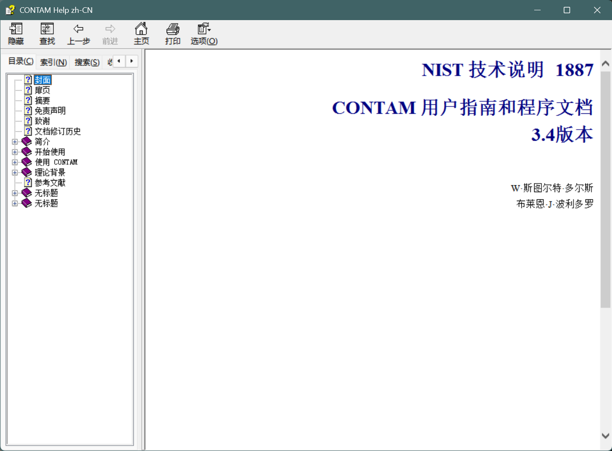
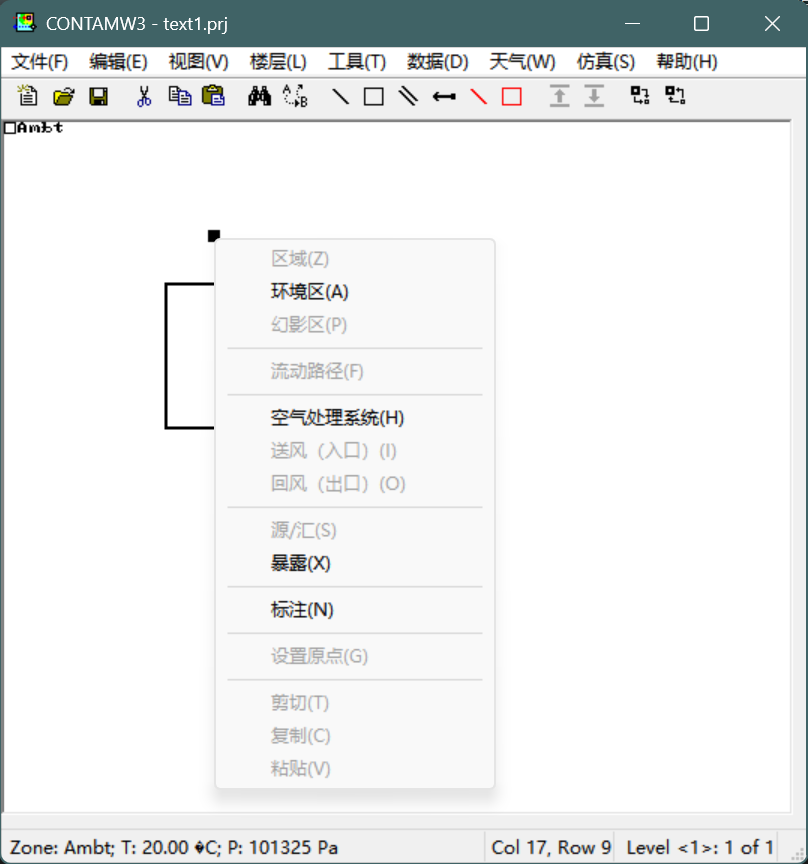

# contam_chinese

Unofficial Chinese localization for CONTAM (based on CONTAM 3.4.0.8)

`contam_chinese` is an unofficial Chinese localization project for CONTAM. Runnable files are distributed through GitHub Releases. This repository preserves the project materials used to prepare and publish the localization.

## Download

The runnable package is available from GitHub Releases.

## Usage

1. Download and extract the release archive.
2. Run `contamw3.exe`.
3. Open `ContamHelp.chm` for the Chinese help file.

## Screenshots

## Source And Modification Notice

This project is based on the official CONTAM release from NIST. The repository and release materials retain the following statements:

- `Based on CONTAM developed by NIST.`
- `This is an unofficial Chinese-localized modified distribution.`

This project is not an official NIST release and does not imply NIST endorsement.

## Base Version

As of `2026-03-16`, the latest version listed on the official NIST download page is `CONTAM 3.4.0.8`, released on `2026-01-08`. The same page states that the bundled `ContamX` version is `3.4.0.3`.

The release package for this project uses the following binary versions:

- `contamw3.exe`: `3.4.0.8`
- `contamx3.exe`: `3.4.0.3`
- `prjup.exe`: `3.4.0.3`
- `simread.exe`: `3.4.0.3`
- `simcomp.exe`: `3.4.0.3`

## Repository Contents

- `README.md`
  - project overview and download guidance
- `NOTICE.md`
  - source and modification notice
- `build_assets/`
  - program resource localization files, translation cache, and related scripts
- `tools/`
  - maintenance and packaging scripts
- `docs/`
  - supplementary release documents

## Notes

The main public entry points of this project are this `README.md` file and the GitHub Releases page.

## References

- [NIST CONTAM Download Page](https://www.nist.gov/el/energy-and-environment-division-73200/nist-multizone-modeling/software/contam/download)
- [NIST CONTAM Software Page](https://www.nist.gov/services-resources/software/contam)
- [NIST TN 1887r1 Document](https://doi.org/10.6028/NIST.TN.1887r1)
